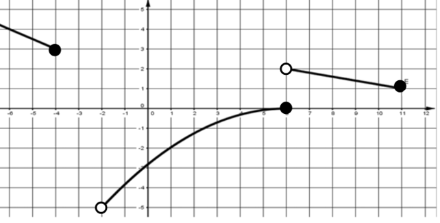
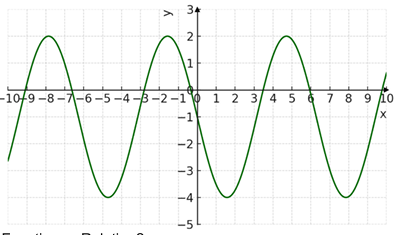
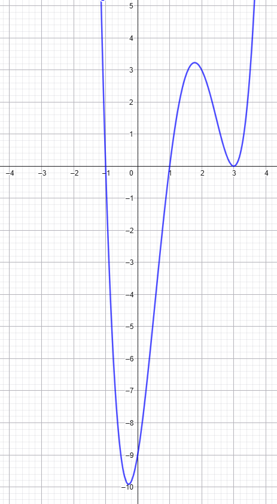
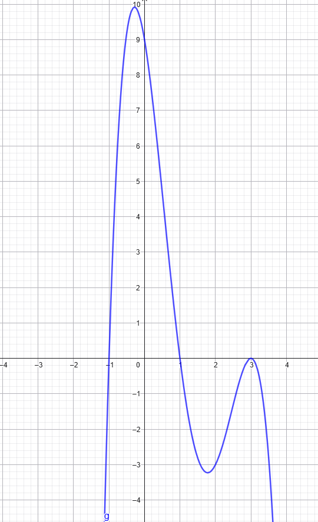
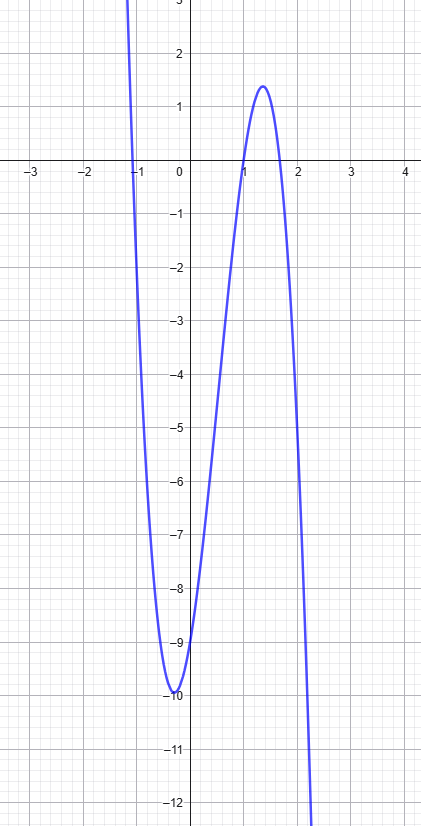
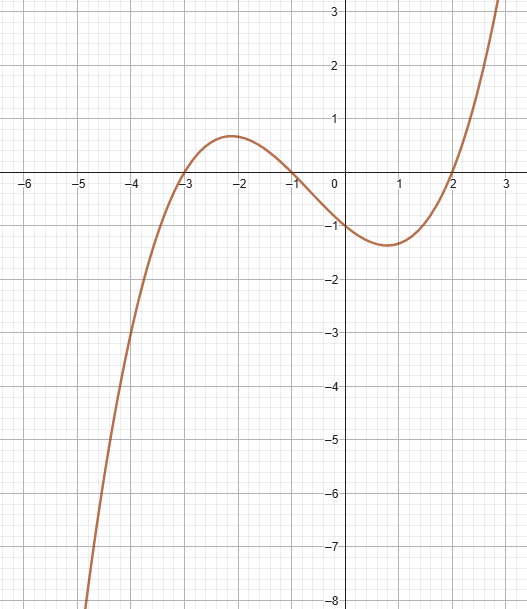

<!DOCTYPE html>
<html lang="en">
<head>
  <meta charset="UTF-8" />
  <meta name="viewport" content="width=device-width, initial-scale=1.0" />
  <title>All Course Practice Exercises</title>

  
</head>

<body>
  <header>
    <h1>All Course Practice Exercises</h1>
    
Interactive practice for linear, quadratic, polynomial, and modeling topics.

  </header>

  <main>
    <section id="startScreen" class="card start-card">
      Mathematical Modeling Practice
      <h2>Practice with mixed exercises from the course</h2>
      

        You will answer one question at a time. After each answer, the correct option
        and a short explanation will appear.
      

      <button class="btn btn-primary" onclick="startPractice()">Start Practice</button>
    </section>

    <section id="quizScreen" class="card hidden">
      

        

          

            Question 1 of 19
            Score: 0
          

          

            

          

        

      

      

      

        <button id="checkBtn" class="btn btn-primary" onclick="checkAnswer()">Check Answer</button>
        <button id="nextBtn" class="btn btn-secondary hidden" onclick="nextQuestion()">Next Question</button>
      

    </section>

    <section id="resultScreen" class="card hidden">
      Practice Completed
      <h2>Your Results</h2>
      

      

      

        <button class="btn btn-primary" onclick="restartPractice()">Practice Again</button>
      

      <h3>Review</h3>
      

    </section>
  </main>

  
  
  
</body>
</html>
